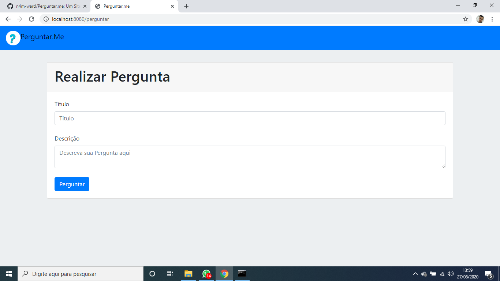
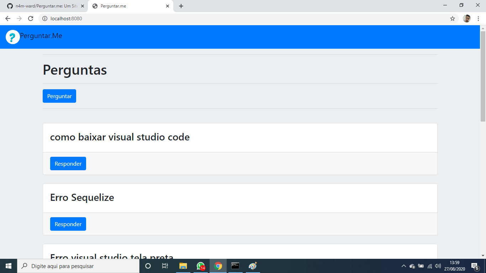

<h1> Perguntar.me</h1>
<h2>Um Site de perguntas estilo YaHoo!</h2>
<h3>Feito em</h3>
<ul>
<li>Bootstrap</li>
<li>Node.js</li>
<li>Mysql</li>
</ul>

O site atualmente consiste em duas paginas, uma onde a pergunta é feita, contendo campo de titulo e descrição, 
e outra onde as perguntas são listadas e podem ser respondidas(não ainda, vou adicionar isso em proximas commits)

<h2>Pagina de Pergunta</h2>

 

 
<h2>Pagina principal</h2>

Ela ainda esta bem incompleta, quero adicionar uma sessão de login para autenticar usuario, listando nomes de quem fez o comentario, 
e posteriormente de quem respondeu o mesmo, dentre outras coisas

